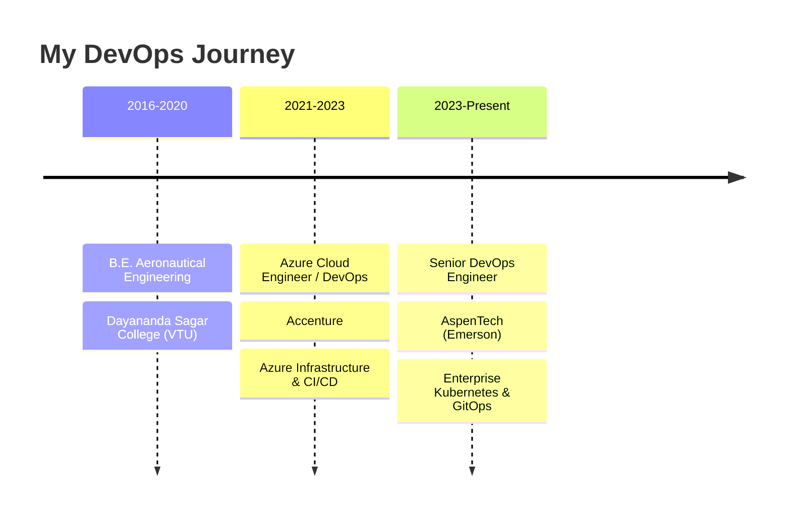

<div align="center">
  
<!-- Animated Header -->


<!-- Typing Animation -->
<a href="https://git.io/typing-svg"></a>

<!-- Profile Views & Social Badges -->
<p>
  
  <a href="https://linkedin.com/in/sanjay-s-094586160"></a>
  <a href="https://sanjaysundarmurthy-portfolio.vercel.app"></a>
  <a href="mailto:sanjaysundarmurthy@gmail.com"></a>
</p>

</div>

---

## 🚀 About Me

```yaml
name: Sanjay S
location: Bangalore, Karnataka, India
current_role: Senior DevOps Engineer @ AspenTech (Emerson)
education: B.E. Aeronautical Engineering - Dayananda Sagar College of Engineering (VTU)
work_authorization: B1/B2 US Visa Holder

expertise:
  - Cloud Infrastructure & Architecture (Azure)
  - Container Orchestration (Kubernetes, AKS, Docker)
  - CI/CD Pipeline Design (Azure DevOps, GitHub Actions)
  - Infrastructure as Code (Terraform, ARM, Ansible)
  - Observability & SRE (Prometheus, Grafana, ELK)
  
currently_learning:
  - MLOps & AI Integration in DevOps
  - Advanced Kubernetes Security
  - Platform Engineering
  
fun_fact: "I transitioned from Aeronautical Engineering to DevOps - now I help applications fly in the cloud! ☁️✈️"
```

---

## 🛠️ Tech Stack

<div align="center">

### ☁️ Cloud & Infrastructure


### 🔧 CI/CD & Automation


### 📊 Monitoring & Observability


### 💻 Languages & Scripting


### 🔒 Security & Quality


</div>

---

## 🏆 Certifications & Achievements

<div align="center">

| Certification | Badge |
|:-------------:|:-----:|
| **Microsoft Azure Fundamentals** |  |
| **Microsoft Security, Compliance & Identity** |  |
| **Microsoft Power Platform Fundamentals** |  |

🥇 **Microsoft Cybersecurity Award** - Accenture Azure Tech Competition  
⭐ **Multiple Awards** for High-Impact DevOps Contributions

</div>

---

## 📈 GitHub Stats

<div align="center">
  


</div>

---

## 🔥 Featured Projects

<div align="center">

[](https://github.com/SanjaySundarMurthy/Enterprise-k8s-platform)
[](https://github.com/SanjaySundarMurthy/Azure-DevOps-Pipelines)

[](https://github.com/SanjaySundarMurthy/k8s-observability-stack)
[](https://github.com/SanjaySundarMurthy/container-security-pipeline)

</div>

---

## 📊 Contribution Graph

<div align="center">
  
[](https://github.com/SanjaySundarMurthy)

</div>

---

## 💼 Work Experience



---

## 🤝 Let's Connect!

<div align="center">

💬 **Open to opportunities in DevOps, Cloud Architecture, and Platform Engineering roles**

<a href="https://sanjaysundarmurthy-portfolio.vercel.app">
  
</a>

<br/><br/>

<a href="https://linkedin.com/in/sanjay-s-094586160">
  
</a>
<a href="mailto:sanjaysundarmurthy@gmail.com">
  
</a>
<a href="tel:+919901244652">
  
</a>

</div>

---

<div align="center">
  
### 💭 Quote I Live By

> *"Automate the mundane, orchestrate the complex, and never stop learning."*

<br/>


</div>
